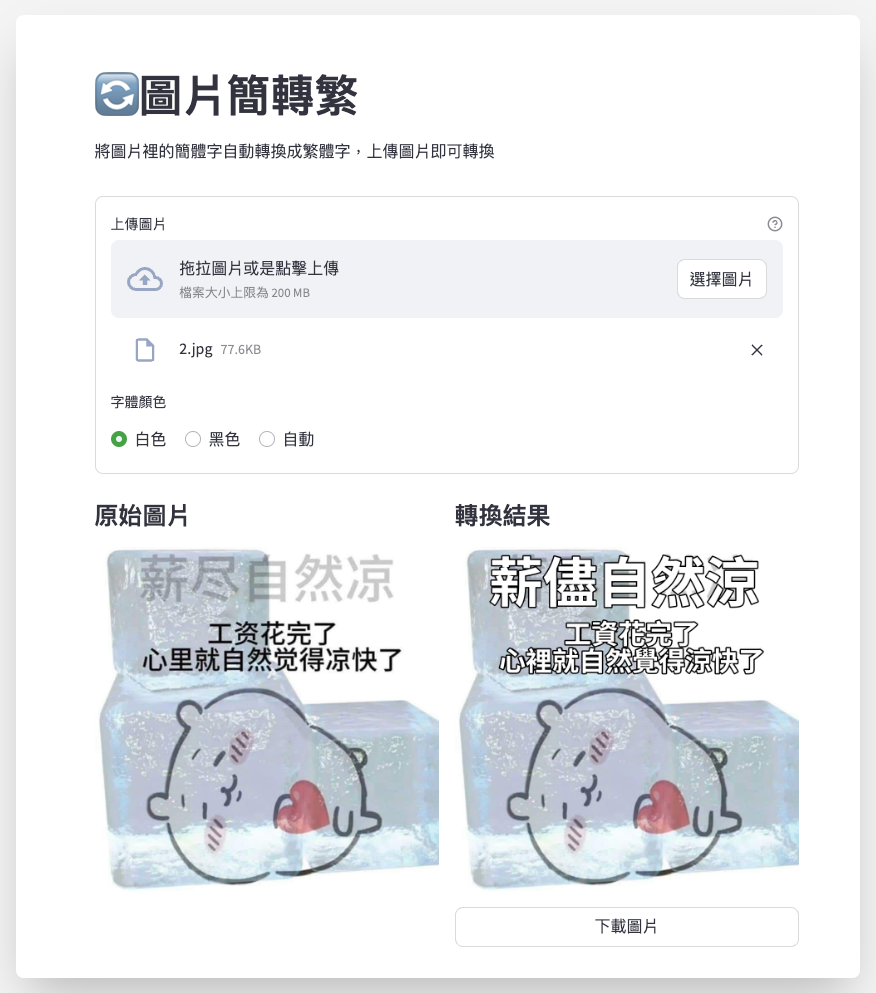

# 圖片簡轉繁 Meme TW translator

將圖片裡的簡體字自動轉換成繁體中文

A simple tool for translating image's Simplified Chinese to Traditional Chinese


[🔗 Live Demo](https://meme-tw-translator.streamlit.app/)




---

## Getting Started

Python version: `3.11`

1. Install dependencies
```sh
pip install -r requirements.txt
```

2. Start
```sh
streamlit run app.py
```

---


## Dependencies

This app is built using the following open-source packages:

- [EasyOCR](https://github.com/JaidedAI/EasyOCR)
- [OpenCC](https://github.com/BYVoid/OpenCC)
- [streamlit](https://github.com/streamlit/streamlit)


## Notes

>Some personal notes

- Deployment notes:
  - Tried deploying on AWS EC2 t2.micro, but it ran out of memory and couldn’t run the app.
  - So it's currently deployed on Streamlit Cloud
- Future improvements:
  - Avoid re-recognizing the same input when drawing text in different colors
  - Remove the original text
